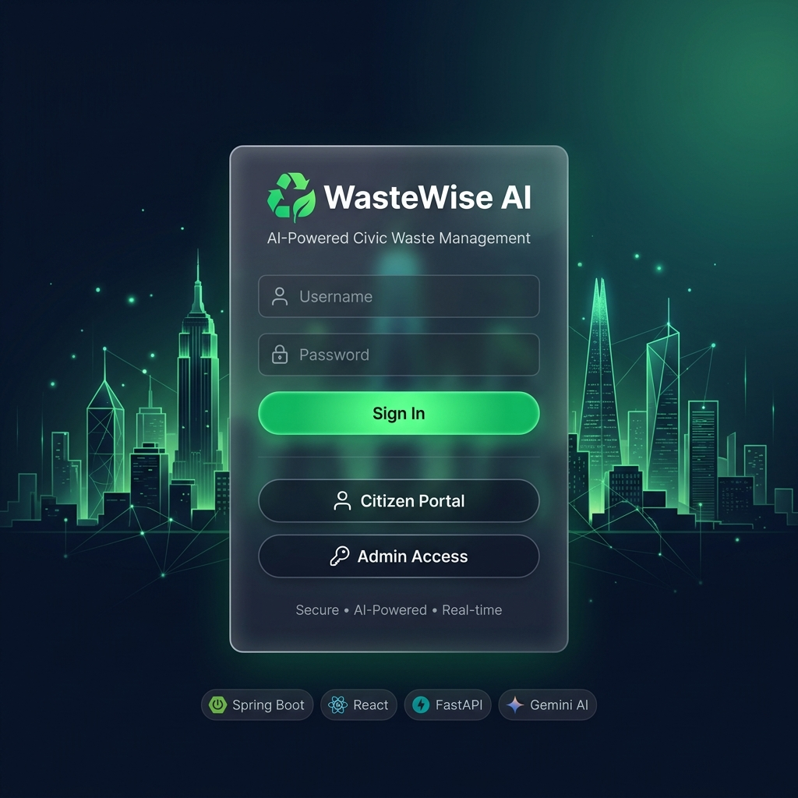
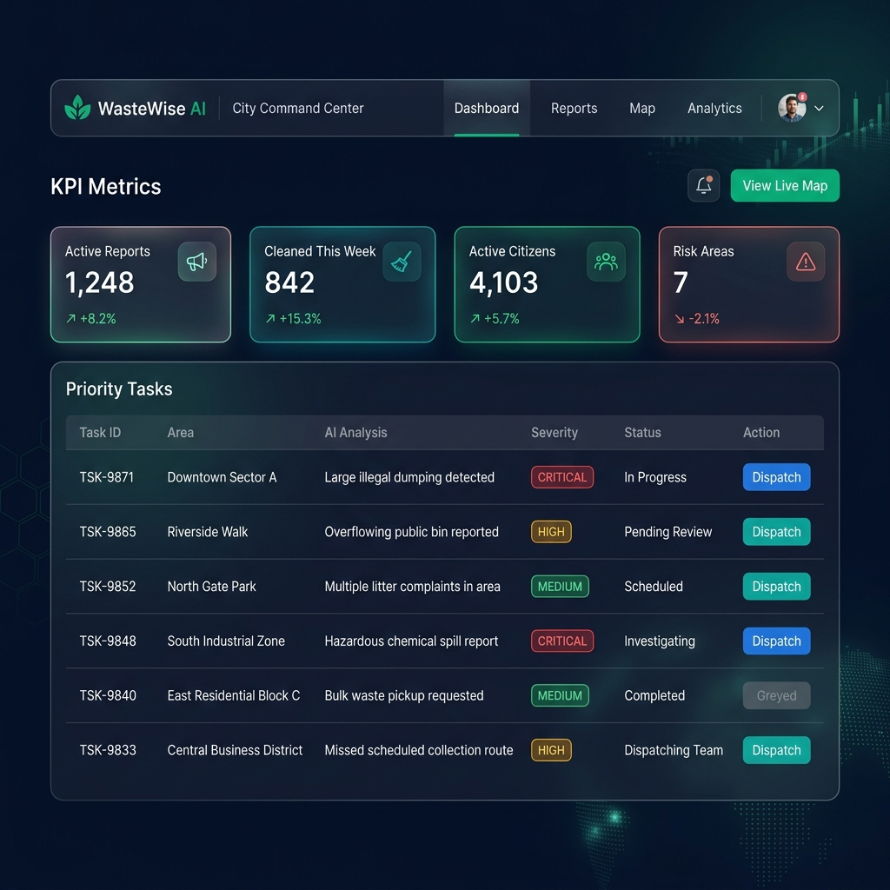
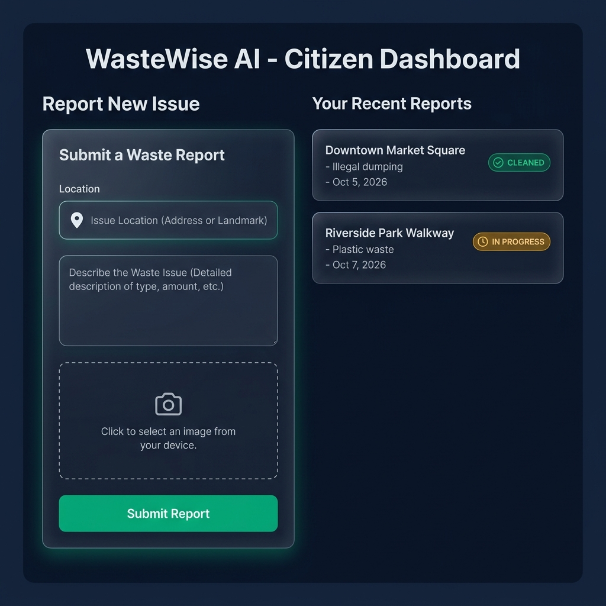
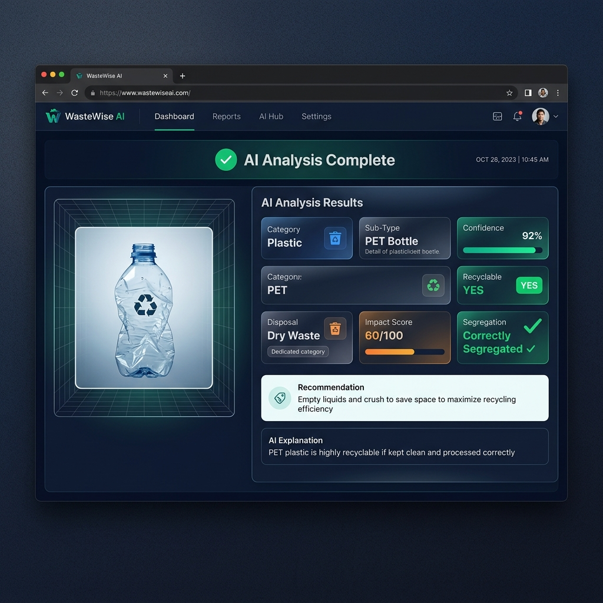
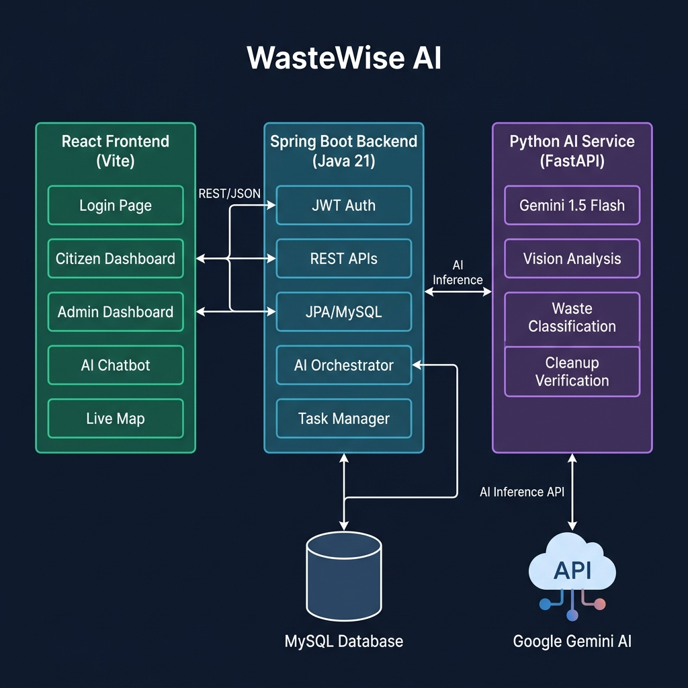

<<<<<<< HEAD
<div align="center">

# 🌿 WasteWise AI

### AI-Powered Civic Waste Management Decision-Support System

[](https://spring.io/projects/spring-boot)
[](https://reactjs.org/)
[](https://fastapi.tiangolo.com/)
[](https://ai.google.dev/)
[](https://openjdk.org/projects/jdk/21/)
[](https://www.mysql.com/)
[](LICENSE)

> **WasteWise AI** bridges the gap between citizens and city administrators through AI-driven waste analysis, real-time reporting, and proactive intervention prioritization — making cities cleaner, smarter, and more sustainable.

</div>

---

## 📸 Project Screenshots

### 🔐 Login Page


### 🏙️ Admin Command Center


### 👥 Citizen Dashboard


### 🤖 AI Waste Analysis Results


### 🗺️ System Architecture


---

## 🚀 Features

### 👤 For Citizens
- **📸 Waste Reporting** — Upload photos of waste incidents with location tagging
- **🤖 AI Image Analysis** — Powered by Gemini 1.5 Flash for instant waste classification
- **📋 Report Tracking** — View status of submitted reports (Pending → In Progress → Cleaned)
- **💬 AI Chatbot** — Conversational assistant for disposal guidance and queries

### 🏛️ For City Administrators
- **📊 City Command Center** — Real-time KPI dashboard with city-wide sanitation metrics
- **🧠 AI Priority Engine** — Automatically ranks cleanup tasks by severity and impact
- **🗺️ Live City Map** — Visual hotspot map with pinned critical areas
- **✅ Cleanup Verification** — Before/After AI image comparison to confirm cleanups
- **📈 Trend Analytics** — Track cleaning performance over time

### 🔒 Security & Access
- **JWT Authentication** — Secure, stateless token-based auth
- **Role-Based Access** — Strict separation between `CITIZEN` and `ADMIN` roles
- **8-Character Auth Codes** — Alphanumeric admin access control
- **CORS-Protected APIs** — Configured for production-ready cross-origin security

---

## 🏗️ System Architecture

```
┌─────────────────────────────────────────────────────────────────┐
│                        WasteWise AI Platform                    │
├─────────────────┬───────────────────────┬───────────────────────┤
│   React Frontend│  Spring Boot Backend  │  Python AI Service    │
│    (Vite + JSX) │     (Java 21)         │     (FastAPI)         │
│                 │                       │                       │
│  • Login Page   │  • JWT Auth           │  • Gemini 1.5 Flash   │
│  • Citizen UI   │  • REST APIs          │  • Waste Detection    │
│  • Admin UI     │  • JPA/MySQL ORM      │  • Classification     │
│  • AI Chatbot   │  • AI Orchestration   │  • Cleanup Verify     │
│  • Live Map     │  • Task Prioritizer   │  • Impact Score       │
├─────────────────┴───────────────────────┴───────────────────────┤
│                    MySQL 8.0 Database                           │
│           Users │ Reports │ Tasks │ Area Intelligence           │
└─────────────────────────────────────────────────────────────────┘
```

### Data Flow
```
Citizen uploads image
      │
      ▼
React Frontend ──REST/JSON──► Spring Boot Backend
                                      │
                                      ├──► MySQL (store report)
                                      │
                                      └──► FastAPI AI Service ──► Gemini 1.5 Flash
                                                │
                                                ▼
                            AI Analysis Result (Category, Confidence,
                            Recyclability, Impact Score, Recommendation)
                                                │
                                                ▼
                            Admin Dashboard (Priority Task Created)
```

---

## 🛠️ Tech Stack

| Layer | Technology | Version | Purpose |
|-------|-----------|---------|---------|
| **Frontend** | React + Vite | 18 / 5.x | SPA with hot-reload |
| **Styling** | Vanilla CSS | — | Glassmorphism dark UI |
| **Icons** | Lucide React | Latest | UI icon library |
| **Backend** | Spring Boot | 3.3.5 | REST API server |
| **Language** | Java | 21 (LTS) | Backend runtime |
| **Auth** | JJWT | 0.12.6 | JWT token handling |
| **ORM** | Spring Data JPA | — | Database abstraction |
| **Database** | MySQL | 8.0 | Persistent storage |
| **AI Service** | FastAPI | 0.104+ | AI inference server |
| **AI Model** | Gemini 1.5 Flash | — | Vision + NLP analysis |
| **AI SDK** | google-generativeai | Latest | Python Gemini client |

---

## 📁 Project Structure

```
wastewiseAiI/
├── 📂 frontend/                  # React + Vite SPA
│   ├── src/
│   │   ├── pages/
│   │   │   ├── Login.jsx         # Authentication page
│   │   │   ├── AdminDashboard.jsx # City Command Center
│   │   │   └── CitizenDashboard.jsx # Citizen reporting portal
│   │   ├── components/
│   │   │   ├── Navbar.jsx        # Top navigation bar
│   │   │   └── Chatbot.jsx       # AI assistant chatbot
│   │   ├── utils/                # Helpers & API clients
│   │   ├── App.jsx               # Root component + routing
│   │   └── index.css             # Global design system
│   └── package.json
│
├── 📂 backend/                   # Spring Boot Java API
│   └── src/main/java/com/wastewise/
│       ├── auth/                 # JWT + Spring Security config
│       ├── user/                 # User entity & registration
│       ├── report/               # Waste report CRUD
│       ├── task/                 # AI priority task management
│       └── WastewiseApplication.java
│
├── 📂 python-ai/                 # FastAPI AI Inference Service
│   ├── main.py                   # FastAPI app entry point
│   ├── vision_service.py         # Gemini image analysis
│   ├── prompts.py                # AI system prompts
│   ├── models.py                 # Pydantic request/response models
│   └── requirements.txt
│
└── 📂 docs/
    └── screenshots/              # Project output images
```

---

## ⚡ Quick Start

### Prerequisites

Make sure you have installed:
- **Node.js** v18+ and npm
- **Java** 21 (JDK)
- **Maven** 3.9+
- **Python** 3.10+
- **MySQL** 8.0
- **Google Gemini API Key** (free at [ai.google.dev](https://ai.google.dev))

---

### 1️⃣ Clone the Repository

```bash
git clone https://github.com/SahilHasure99/Wasteclean-AI.git
cd Wasteclean-AI
```

---

### 2️⃣ Configure the Database

Create a MySQL database:
```sql
CREATE DATABASE wastewise_db CHARACTER SET utf8mb4 COLLATE utf8mb4_unicode_ci;
```

Update `backend/src/main/resources/application.properties`:
```properties
spring.datasource.url=jdbc:mysql://localhost:3306/wastewise_db
spring.datasource.username=YOUR_MYSQL_USER
spring.datasource.password=YOUR_MYSQL_PASSWORD
spring.jpa.hibernate.ddl-auto=update

# JWT Secret (change this in production!)
jwt.secret=YourSuperSecretKeyThatIsAtLeast256BitsLong
jwt.expiration=86400000
```

---

### 3️⃣ Start the Spring Boot Backend

```bash
cd backend
mvn spring-boot:run
```

> Backend starts on **http://localhost:8080**

---

### 4️⃣ Start the Python AI Service

```bash
cd python-ai

# Create a virtual environment
python -m venv .venv
.venv\Scripts\activate       # Windows
# or: source .venv/bin/activate  (Linux/macOS)

# Install dependencies
pip install -r requirements.txt

# Set your Gemini API key
$env:GEMINI_API_KEY="your_api_key_here"   # Windows PowerShell
# or: export GEMINI_API_KEY="your_api_key_here"  (Linux/macOS)

# Start the AI service
uvicorn main:app --reload --port 8000
```

> AI Service starts on **http://localhost:8000**

---

### 5️⃣ Start the React Frontend

```bash
cd frontend
npm install
npm run dev
```

> Frontend starts on **http://localhost:5173**

---

## 🔑 API Endpoints

### Spring Boot Backend (Port 8080)

| Method | Endpoint | Auth | Description |
|--------|----------|------|-------------|
| `POST` | `/api/auth/login` | Public | Authenticate & get JWT token |
| `POST` | `/api/auth/register` | Public | Register new citizen |
| `POST` | `/api/reports` | Citizen | Submit new waste report |
| `GET` | `/api/reports/my` | Citizen | Get own reports |
| `GET` | `/api/admin/dashboard` | Admin | City-wide KPI metrics |
| `GET` | `/api/admin/tasks` | Admin | AI priority task list |
| `PUT` | `/api/admin/tasks/{id}/dispatch` | Admin | Dispatch cleanup team |

### Python AI Service (Port 8000)

| Method | Endpoint | Description |
|--------|----------|-------------|
| `POST` | `/analyze-waste` | Analyze waste image with Gemini AI |
| `POST` | `/verify-cleanup` | Before/after cleanup verification |
| `GET` | `/health` | Service health check |

---

## 🤖 AI Capabilities

The **Gemini 1.5 Flash** powered vision service can detect and classify:

| Field | Description |
|-------|-------------|
| `category` | Plastic, Organic, E-Waste, Metal, Paper, etc. |
| `subType` | PET Bottle, Cardboard Box, Food Waste, etc. |
| `confidence` | 0.0 – 1.0 confidence score |
| `recyclable` | Whether the item can be recycled |
| `disposalCategory` | Dry Waste / Wet Waste / Hazardous |
| `recommendation` | User-friendly disposal instruction |
| `impactScore` | Environmental impact score (0–100) |
| `correctlySegregated` | Was waste properly sorted? |

---

## 🎨 Design System

WasteWise AI uses a premium **dark glassmorphism** design:

| Token | Value | Usage |
|-------|-------|-------|
| Background | `#0f172a` | App background |
| Surface | `#1e293b` | Card backgrounds |
| Primary | `#10b981` | Emerald green — actions, success |
| Secondary | `#14b8a6` | Teal — secondary accents |
| Warning | `#f59e0b` | Amber — in-progress states |
| Danger | `#ef4444` | Red — critical severity |
| Text | `#f1f5f9` | Primary text |
| Muted | `#94a3b8` | Secondary text |

---

## 👥 User Roles

### 🧑 Citizen
- Register and log in to the citizen portal
- Upload waste images for AI analysis
- Track submitted report statuses
- Chat with the AI waste advisor

### 🏛️ Admin
- Access the City Command Center (admin credentials required)
- View AI-generated task priority queue
- Dispatch cleanup teams
- View city-wide metrics and live map
- Verify cleanup completions

---

## 🤝 Contributing

Contributions are welcome! Here's how:

1. **Fork** the repository
2. **Create** a feature branch: `git checkout -b feature/your-feature-name`
3. **Commit** your changes: `git commit -m 'Add some amazing feature'`
4. **Push** to the branch: `git push origin feature/your-feature-name`
5. **Open** a Pull Request

Please ensure:
- Code follows existing style conventions
- New API endpoints are documented
- Frontend components are reusable and well-structured

---

## 📄 License

This project is licensed under the **MIT License** — see the [LICENSE](LICENSE) file for details.

---

## 🙏 Acknowledgements

- [Google Gemini AI](https://ai.google.dev/) — for powering the waste vision analysis
- [Spring Boot](https://spring.io/projects/spring-boot) — for the robust Java backend
- [FastAPI](https://fastapi.tiangolo.com/) — for the blazing-fast AI inference service
- [Lucide React](https://lucide.dev/) — for the beautiful icon library
- [Vite](https://vitejs.dev/) — for the lightning-fast frontend build tool

---

<div align="center">

**Built with ❤️ to make our cities cleaner and smarter.**

⭐ **Star this repo** if you found it helpful!

[🐛 Report Bug](https://github.com/SahilHasure99/Wasteclean-AI/issues) · [✨ Request Feature](https://github.com/SahilHasure99/Wasteclean-AI/issues) · [📖 Documentation](https://github.com/SahilHasure99/Wasteclean-AI/wiki)

</div>
=======
# Wasteclean-AI
this is for hackthon project 
>>>>>>> origin/main
